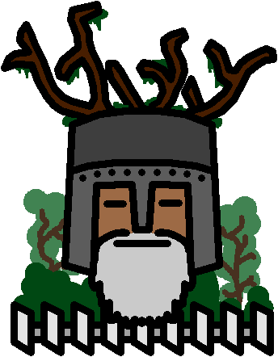
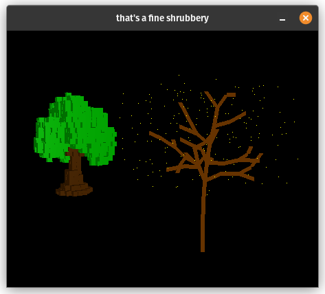

# shrubbery

rust library: Space colonization implementation, for generating trees / shrubbery, with built in voxelization utility.

### Screenshot example: voxel.
left: Voxel tree

right: debug representation of branches + attractors renders as yellow dots.


## Example code
```rs
let mut shrubbery = Shrubbery::new(
    vec3(0., 0., 0.), // rot position
    vec3(0., 1., 0.), // initial growth dir
    AlgorithmSettings {
        branch_len: 2.0,
        leaf_attraction_dist: 6.0,
		..Default::default()
    },
    AttractorGeneratorSettings::default(),
);

// spawn particles for tree to grow into
shrubbery.spawn_attractors_from_shape(
    vec3(0., 5. + 8.0, 0.),
    BoxShape {
        x: 15.0,
        y: 10.0,
        z: 15.,
    },
);

// keep spawning root branches until attractors can be found
shrubbery.build_trunk();

// grow tree 8 times
(0..8).for_each(|_|shrubbery.grow());

// make data for the tree as a voxel
let mut voxels = voxelize(shrubbery, VoxelizeSettings::default());

```

## License

Shrubbery is free and open source! All code in this repository is dual-licensed under either:

* MIT License ([LICENSE-MIT](docs/LICENSE-MIT) or [http://opensource.org/licenses/MIT](http://opensource.org/licenses/MIT))
* Apache License, Version 2.0 ([LICENSE-APACHE](docs/LICENSE-APACHE) or [http://www.apache.org/licenses/LICENSE-2.0](http://www.apache.org/licenses/LICENSE-2.0))

at your option.

Unless you explicitly state otherwise, any contribution intentionally submitted
for inclusion in the work by you, as defined in the Apache-2.0 license, shall be dual licensed as above, without any
additional terms or conditions.
