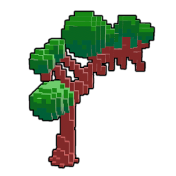
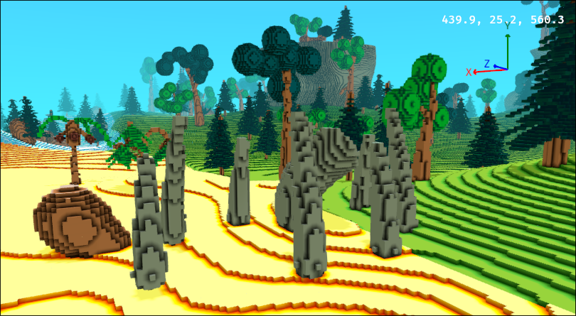
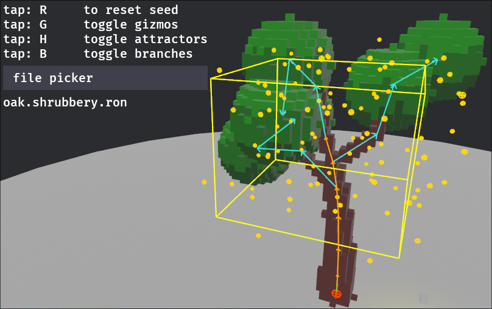

# shrubbery


Shrubbery is a procedural voxel generation library for rust projects.
Features:
* Serializable shaping logic
* Built in space colonization implementation
* Deterministic generation

## Integrate into any game
This is my voxel game, utilizing shrubbery.ron assets.


## Example: "editor"
The editor example code, can preview ANY shrubbery.ron asset. 


## Example code: minimal
```rs
fn main() {
    let shrubbery_settings = shrubbery_settings();
    let seed = rand::random();
    let mut generator = ShrubberyGenerator::generate(seed, &shrubbery_settings);
    let voxels = generator.voxelize();
}
```

Runnable demos live in `examples/` (e.g. `cargo run --example bevy_cycle`).

## How a shrubbery is designed
Here is all shaping features:
* Branch (3D lines with start + end point)
* Shape::Sphere, spawned on branch end points
* Shape::ConiferWhorl, segmented 4-star shape, placed along a branch's start-end point. Perfect for fir/pine trees.
* Shape::Starleaf, a 4-star shape.

You construct building steps, here is an example based upon: "Assets/oak.shrubbery.ron"
```ron
(
    build_steps: [
        SpawnRoot(( id: AssignId(0), )),
        Grow((
            times: Value(7),
            length: Range(3.0, 5.0),
            thickness: IterationScale(min: Value(3.0), max: Value(1.0),),
            filter: (ignore_root: false),
        )),
        SpawnAttractors((
            location: FromBranch(()),
            shape: Cube((size_x: 25.0, size_y: 20.0, size_z: 25.0)),
            attractor_spacing: AttractorSpacing(attractor_spacing: 6.0, jitter_ratio: 1.0),
        )),
        // spawn new branches using space colonization to fill the attractor space
        Grow((
            times: Value(3),
            dir: Attractor(()),
            length: Value(8.0),
            filter: (id: Target(1)),
        )),
        Shape((
            shape: Sphere(radius: Value(6.0)),
            voxel: Value(Solid(VoxelMapping(name: "leaf_orange"))),
            filter: (iteration: Greater(0)),
    ],
)
```

## Feature flags

| Feature | Default | Description |
|---------|---------|-------------|
| `serde` | ✓ | Serialization for settings and voxel definitions (RON, etc.) |
| `bevy` | ✓ | Bevy integration: `shrubbery.ron` asset loader, plugin, debug draw. Implies `serde` and pulls in `ron` |


## Bevy support table

| bevy | shrubbery |
|--------|---------|
| 0.17.3 | 0.2     |

## Testing

```sh
cargo test
```

Determinism is verified with golden hashes: `tests/golden_hashes/*.golden.ron`
record the expected voxel-output hash for every asset in `assets/shrubbery/`
at a fixed set of seeds. The tests discover assets automatically — there is no
hard-coded list.

If you **intentionally change generation behavior** or **add a new asset**,
the golden hash test will fail until you regenerate and commit the goldens:

```sh
cargo test --test generate_golden_hashes -- --ignored --nocapture
```

Review the resulting diff carefully — a changed golden hash means the voxel
output for that asset and seed changed.

## License

Shrubbery is free and open source! All code in this repository is dual-licensed under either:

* MIT License ([LICENSE-MIT](docs/LICENSE-MIT) or [http://opensource.org/licenses/MIT](http://opensource.org/licenses/MIT))
* Apache License, Version 2.0 ([LICENSE-APACHE](docs/LICENSE-APACHE) or [http://www.apache.org/licenses/LICENSE-2.0](http://www.apache.org/licenses/LICENSE-2.0))

at your option.

Unless you explicitly state otherwise, any contribution intentionally submitted
for inclusion in the work by you, as defined in the Apache-2.0 license, shall be dual licensed as above, without any
additional terms or conditions.
